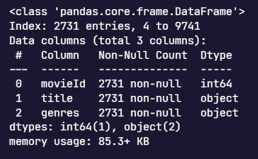
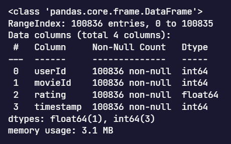
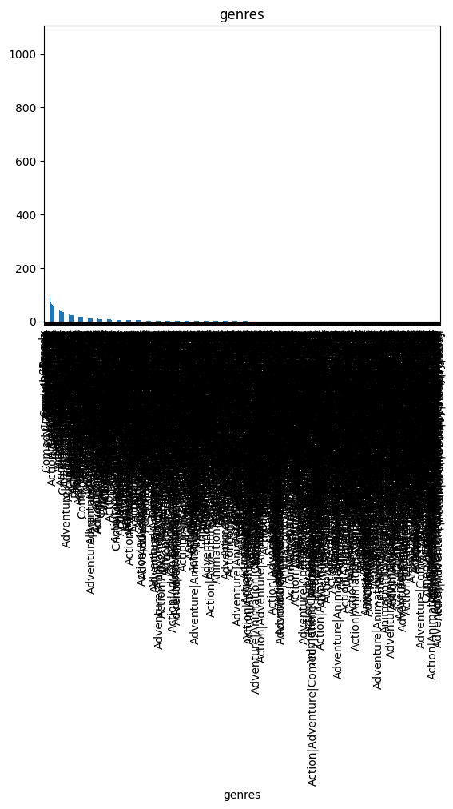
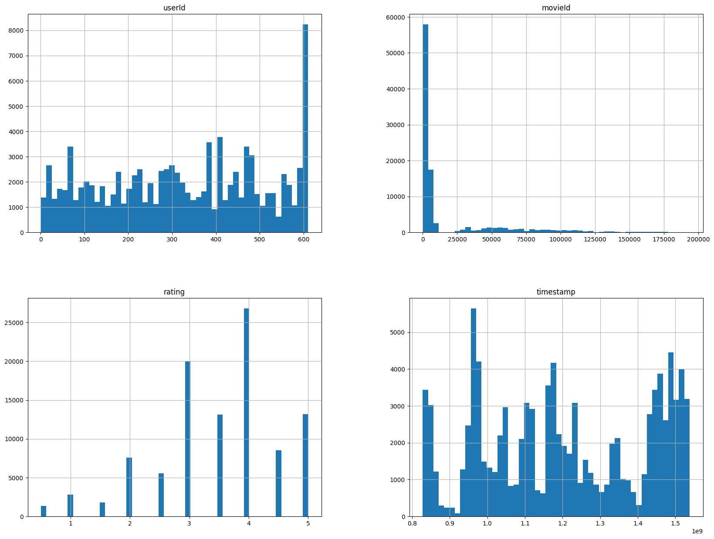

# Laporan Proyek Machine Learning Terapan - Muhammad Abdiel Firjatullah

## Project Overview

Pada proyek ini akan membahas tentang sebuah perusahaan yang bergerak di industri perfilman yang ingin meningkatkan _traffic platform film streaming_ mereka, oleh karena itu perusahaan akan mencoba membuat sistem rekomendasi dengan menerapkan pendekatan _Machine Learning_ untuk merekomendasi film-film yang mereka sediakan berdasarkan genre film untuk para customer mereka.

Tujuan dirancangnya sebuah sistem rekomendasi adalah untuk memberikan rekomendasi yang sesuai dengan kebutuhan pengguna. Berdasarkan Jurnal Teknik Informatika dan Sistem Informasi Fakultas Teknologi Informasi, Universitas Kristen Maranatha menyatakan bahwa _"Sistem rekomendasi adalah fitur-fitur dan teknik-teknik pada perangkat lunak yang menyediakan sesuatu hal yang berguna untuk user. Sistem rekomendasi juga menyediakan rekomendasi-rekomendasi dari beberapa item yang berpotensi menarik untuk pengguna"_ [[1]](https://www.neliti.com/id/publications/140821/penerapan-metode-content-based-filtering-pada-sistem-rekomendasi-kegiatan-ekstra). Hal ini menjadi penting mengingat tidak semua pengguna dapat menentukan pilihannya saat pertama kali menggunakan suatu aplikasi atau layanan.

### Latar belakang

Film merupakan salah satu bentuk media komunikasi massa dari berbagai macam teknologi dan berbagai unsur-unsur kesenian. Perpaduan yang seimbang dan harmonis antara seni sastra, seni musik, seni peran dan komedi dikemas menjadi satu dalam bentuk film [[2]](http://books.uinsby.ac.id/id/eprint/216/3/Yoyon%20Mudjiono_Kajian%20Semiotika%20dalam%20Film.pdf). Menonton film adalah alternatif hiburan yang sering dipilih ketika merasa penat atau bosan dengan rutinitas. Apalagi kini banyak tersedia _platform digital_ dari yang gratis hingga berbayar yang menawarkan beragam genre film dan bisa ditonton di mana saja melalui ponsel.

Dengan begitu banyak pilihan film yang tersedia di platform digital, pengguna sering kali menghadapi kesulitan dalam menemukan film yang sesuai dengan minat mereka. Tanpa sistem rekomendasi yang efektif, pengguna mungkin merasa frustrasi karena harus mencari secara manual di antara ribuan judul, yang dapat mengakibatkan kebosanan dan penurunan kepuasan pengguna. Selain itu, kekurangan rekomendasi yang relevan dapat menyebabkan rendahnya keterlibatan pengguna dengan platform, sehingga mengurangi waktu yang dihabiskan di platform dan, pada akhirnya, menurunkan trafik keseluruhan.

Untuk mengatasi masalah ini dan meningkatkan kepuasan pengguna, perusahaan berencana untuk mengimplementasikan sistem rekomendasi berbasis Machine Learning. Dengan menggunakan pendekatan ini, sistem dapat secara otomatis menyarankan film yang relevan berdasarkan genre yang disukai pengguna. Pendekatan ini tidak hanya akan membantu pengguna menemukan film yang sesuai dengan minat mereka tetapi juga meningkatkan trafik platform secara signifikan.

Sistem rekomendasi ini akan menganalisis data genre dari film yang telah ditonton atau disukai pengguna untuk memberikan saran yang lebih personal dan relevan. Dengan cara ini, pengguna akan merasa lebih puas dan terlibat, yang pada gilirannya akan meningkatkan waktu yang dihabiskan di platform dan meningkatkan trafik keseluruhan. Implementasi sistem rekomendasi ini adalah langkah strategis dalam memenuhi kebutuhan pengguna, meningkatkan kepuasan, dan memaksimalkan potensi pertumbuhan platform.

## Bussiness Understanding

### Problem Statements

Berdasarkan latar belakang di atas, rincian masalahnya adalah sebagai berikut:

- Model _Machine Learning_ apa yang cocok untuk menyelesaikan permasalahan tersebut?
- Bagaimana cara menentukan hasil rekomendasi suatu model _Machine Learning_ dapat dikatakan baik?

### Goals

Untuk menjawab pertanyaan di atas, maka akan dijabarkan sebagai berikut:

- Menemukan model _Machine Learning_ yang cocok untuk menyelesaikan permasalahan tersebut.
- Menentukan hasil rekomendasi suatu model _Machine Learning_ yang dapat dikatakan baik.

### Solution Statements

Untuk mengatasi masalah yang diidentifikasi dalam latar belakang dan problem statements, berikut adalah solusinya:

- Pemilihan Model Machine Learning: Sistem rekomendasi yang akan dikembangkan menggunakan pendekatan Content-Based Filtering. Pendekatan ini akan merekomendasikan film berdasarkan kesamaan konten dengan film yang pernah ditonton atau disukai oleh pengguna.

- Evaluasi Model: Untuk memastikan model yang dikembangkan dapat memberikan rekomendasi yang baik, akan dilakukan evaluasi dengan menggunakan metrik evaluasi yang sesuai. Metrik yang umum digunakan untuk mengevaluasi sistem rekomendasi termasuk Precision, Recall, dan F1-Score. Evaluasi ini akan membantu menentukan seberapa baik model dalam memberikan rekomendasi yang relevan kepada pengguna.

## Data Understanding

Berikut merupakan informasi dari dataset yang digunakan:

| Jenis                   | Keterangan                                                                                            |
| ----------------------- | ----------------------------------------------------------------------------------------------------- |
| Sumber                  | [Movie Recommender System Dataset](https://www.kaggle.com/datasets/gargmanas/movierecommenderdataset) |
| Pemilik                 | [SHINIGAMI](https://www.kaggle.com/gargmanas)                                                         |
| Lisensi                 | [GPL 2](http://www.gnu.org/licenses/old-licenses/gpl-2.0.en.html)                                     |
| Jenis dan Ukuran Berkas | zip (846KB)                                                                                           |

Tabel 1. Informasi Dataset

Setelah melakukan observasi pada dataset yang diunduh pada kaggle, didapat informasi sebagai berikut:

Pada berkas tersebut terdapat 2 file, yaitu movies.csv dan ratings.csv

- **movies.csv**

  - Terdapat 9742 baris pada _dataset_
  - Tidak ada nilai _null_ pada kolom apapun pada _dataset_
  - Terdapat 20 genre yang berbeda pada kolom _genres_

- **ratings.csv**

  - Terdapat 100836 baris pada _dataset_
  - Tidak ada nilai _null_ pada kolom apapun pada _dataset_

### Deskripsi Variabel

- **movies.csv**  
    
  Gambar 1. Informasi variabel movies  
   Variabel-variabel yang terdapat pada file movies.csv adalah sebagai berikut:

  - _movieId_: id film
  - _title_: Judul film
  - _genres_: genre film

- **ratings.csv**  
    
  Gambar 2. Informasi variabel ratings  
  Variabel-variabel yang terdapat pada file ratings.csv adalah sebagai berikut:
  - _userId_: id user
  - _movieId_: id film
  - _rating_: rating yang diberikan user
  - _timestamp_: waktu user memberikan rating

### Exploratory Data Analysis - Univariate Analysis

- **Movies**  
    
  Gambar 3. Distribusi fitur genre
  Dari hasil visualisasi pada Gambar 3 dapat disimpulkan bahwa:
  - Sebagian besar sampel film dari dataset movies ber-genre _drama_ dan _comedy_, hal tersebut menunjukkan bahwa film yang tersedia lebih banyak ber-genre _drama_ dan _comedy_.
- **Rating**
    
  Gambar 4. Visualisasi fitur numerik rating  
   Dari hasil visualisasi pada gambar 4 dapat disimpulkan bahwa:
  - Rentang rating film adalah 0,5 hingga 5
  - Jumlah sampel terbanyak adalah film yang memiliki rating 4, hal ini menunjukkan bahwa banyak user yang menilai film dengan nilai 4.

## Data Preparation

Berikut merupakan tahapan-tahapan dalam melakukan data preparation:

- _Menggabungkan Dataset dan Menangani Missing Value_  
  Proses ini dilakukan dengan menggabungkan kedua dataset movies.csv dan ratings.csv menggunakan fungsi [_merge()_](https://pandas.pydata.org/docs/reference/api/pandas.DataFrame.merge.html) dan setelah digabungkan data yang memiliki nilai kosong/_null_ akan dihapus menggunakan fungsi [_dropna()_](https://pandas.pydata.org/docs/reference/api/pandas.DataFrame.dropna.html) dengan tujuan agar mudah untuk diproses.

- _Menghapus Data Duplikat_  
  Proses ini dilakukan dengan menggunakan fungsi [_drop_duplicates()_](https://pandas.pydata.org/docs/reference/api/pandas.DataFrame.drop_duplicates.html) agar tidak ada data yang memiliki nilai sama untuk mencegah kekeliruan.

- _Mengonversi Data Series Menjadi Bentuk List_  
  Proses ini dilakukan dengan menggunakan fungsi [tolist()](https://pandas.pydata.org/docs/reference/api/pandas.Series.tolist.html) agar data lebih mudah diproses pada tahap pemodelan.

- _Melakukan Vektorisasi dengan TF-IDF_  
  Pada tahap ini data yang telah disiapkan dikonversi menjadi bentuk vektor menggunakan fungsi [tfidfvectorizer()](https://scikit-learn.org/stable/modules/generated/sklearn.feature_extraction.text.TfidfVectorizer.html) dari library sklearn untuk mengidentifikasi korelasi antara judul film dengan kategori genrenya.

## Modelling

Setelah data selesai disiapkan, proses selanjutnya adalah membuat model adapun tahap-tahapnya diantaranya sebagai berikut:

- _Mengukur tingkat kesamaan dengan [Cosine Similarity](https://scikit-learn.org/stable/modules/generated/sklearn.metrics.pairwise.cosine_similarity.html)_  
  Setelah data dikonversi menjadi bentuk vektor, selanjutnya ukur tingkat kesamaan antara dua vektor dan menentukan apakah kedua vektor tersebut menunjuk ke arah yang sama. Semakin kecil sudut cosinus, semakin besar nilai cosine similarity.

- _Membuat Fungsi movie_recommendations()_
  Tahap terakhir dari proses modeling adalah membuat fungsi untuk mendapatkan hasil _top-N recommendation_, kali ini fungsinya dinamakan _movie_recommendations()_. Cara kerja dari fungsi ini yaitu menggunakan fungsi [argpartition](https://numpy.org/doc/stable/reference/generated/numpy.argpartition.html) untuk mengambil sejumlah nilai k tertinggi dari similarity data (dalam kasus ini: dataframe **cosine_sim_df**). Kemudian mengambil data dari bobot (tingkat kesamaan) tertinggi ke terendah. Data ini lalu dimasukkan ke dalam variabel closest. Berikutnya menghapus movie*title yang dicari menggunakan fungsi [drop()](https://pandas.pydata.org/docs/reference/api/pandas.DataFrame.drop.html) agar tidak muncul dalam daftar rekomendasi.
  Penjelasan parameter dari fungsi \_movie_recommendations()* adalah sebagai berikut:
  - movie_title : Judul film (index kemiripan dataframe) (str)
  - similarity_data : Kesamaan dataframe simetrik dengan judul film sebagai indeks dan kolom (object)
  - items : Mengandung kedua nama dan fitur lainnya yang digunakan untuk mendefinisikan kemiripan (object)
  - k : Banyaknya jumlah rekomendasi yang diberikan (int)

### Result

Setelah model selesai dibuat, panggil model untuk menampilkan hasil rekomendasi, sebagai contoh kita gunakan judul film _Piper (2016)_ untuk menguji model.

|      | id     | movie_title  | genre     |
| ---- | ------ | ------------ | --------- |
| 2565 | 160718 | Piper (2016) | Animation |

Tabel 2. Informasi judul film uji

Dapat terlihat pada Tabel 2 bahwa film _Piper (2016)_ merupakan film dengan genre Animation. Selanjutnya kita lihat rekomendasi film yang sesuai dengan genre yang sama dengan film tersebut.

|     | movie_title                                       | genre     |
| --- | ------------------------------------------------- | --------- |
| 0   | Merry Madagascar (2009)                           | Animation |
| 1   | Investigation Held by Kolobki (1986)              | Animation |
| 2   | Illusionist, The (L'illusionniste) (2010)         | Animation |
| 3   | Vacations in Prostokvashino (1980)                | Animation |
| 4   | Winnie the Pooh Goes Visiting (1971)              | Animation |
| 5   | DC Super Hero Girls: Hero of the Year (2016)      | Animation |
| 6   | Winnie the Pooh and the Day of Concern (1972)     | Animation |
| 7   | Hulk Vs. (2009)                                   | Animation |
| 8   | A Plasticine Crow (1981)                          | Animation |
| 9   | Asterix: The Land of the Gods (Astérix: Le dom... | Animation |

Tabel 3. Hasil rekomendasi

Seperti terlihat pada Tabel 3, model berhasil menampilkan rekomendasi film berdasarkan genrenya.

## Evaluation

Karena model yang digunakan untuk proyek kali ini adalah **_Content-Based Filtering_**, maka metrik yang cocok untuk digunakan adalah _Precision_. Secara matematis dapat dirumuskan sebagai berikut:  
  
Gambar 5. Rumus _precision_ sistem rekomendasi

Berdasarkan hasil yang telah ditampilkan Tabel 3 pada bagian [_Result_](#result) dapat disimpulkan bahwa dari 10 judul film yang direkomendasikan, ada 10 film yang relevan oleh karena itu nilai _Precision_ dari model ini adalah 10/10 atau 100%.

### Relevansi Terhadap Problem Statement:

Model Content-Based Filtering yang diimplementasikan berhasil memberikan rekomendasi film yang relevan berdasarkan preferensi pengguna. Hal ini menjawab langsung kebutuhan untuk meningkatkan pengalaman pengguna dalam menemukan konten yang sesuai dengan minat mereka.

### Pencapaian Goals:

Tujuan utama proyek adalah mengembangkan sistem rekomendasi yang efektif. Dengan mencapai nilai Precision 100%, dapat disimpulkan bahwa model berhasil memberikan rekomendasi yang sangat sesuai dengan preferensi pengguna. Ini mengindikasikan pencapaian goals dalam meningkatkan kualitas rekomendasi produk.

### Dampak Terhadap Business Understanding:

Implementasi model ini memiliki dampak positif terhadap pemahaman bisnis, karena meningkatkan retensi pengguna melalui rekomendasi yang lebih personal. Dengan memberikan rekomendasi yang akurat, sistem ini dapat meningkatkan engagement pengguna dan potensialnya untuk meningkatkan konversi penjualan.

## Conclusion

Setelah melalui proses yang panjang, mulai dari mempersiapkan dataset hingga melakukan evaluasi, akhirnya sistem rekomendasi dengan pendekatan _Machine Learning Content-Based Filtering_ pun selesai dirancang dan hasilnya pun cukup memuaskan yaitu dari 10 judul film yang direkomendasikan, terdapat 10 film yang relevan dengan judul film yang diuji yang menandakan _precision_ dari model ini adalah 100%. Diharapkan dengan dirancangnya sistem rekomendasi ini, _traffic platform film streaming_ perusahaan dapat naik dengan signifikan.

## Referensi

[[1]](https://www.neliti.com/id/publications/140821/penerapan-metode-content-based-filtering-pada-sistem-rekomendasi-kegiatan-ekstra) Firmahsyah, Firmahsyah dan Tiur Gantini. "Penerapan Metode Content-Based Filtering Pada Sistem Rekomendasi Kegiatan Ekstrakulikuler (Studi Kasus Di Sekolah ABC)." _Jurnal Teknik Informatika dan Sistem Informasi_, vol. 2, no. 3, 2016, doi:[10.28932/jutisi.v2i3.548](https://dx.doi.org/10.28932/jutisi.v2i3.548).

[[2]](http://books.uinsby.ac.id/id/eprint/216/3/Yoyon%20Mudjiono_Kajian%20Semiotika%20dalam%20Film.pdf) Mudjiono, Yoyon (2020) _Kajian semiotika dalam film._ Jurnal Ilmu Komunikasi, 1 (1). pp. 125-138. ISSN 2088-981X; 2723-2557
